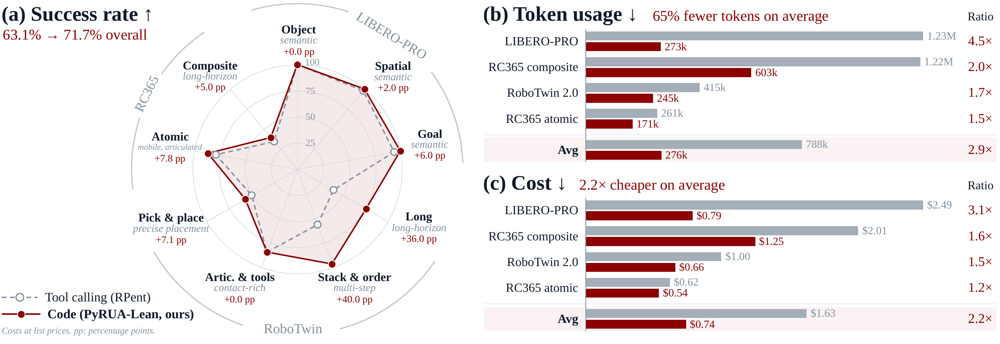

<div align="center">

# PyRUA-Lean

**Fewer Tokens, Better Action: GPT-6 Astra Robot Agents with 14% Higher Success Rate but 65% Fewer Tokens**

[](https://dagroup-pku.github.io/PyRUA-Lean/)

[](LICENSE)
[](pyproject.toml)
[](README.md)
[](README.zh-CN.md)

</div>

**PyRUA-Lean** (*Py*thon for lean *R*obot-*U*se *A*gents, the robot counterpart of computer-use agents)
turns a robot into a Python object. A tool-calling agent spends a full LLM call on every small step of a task
and re-sends everything before it each time. A PyRUA-Lean agent writes code against `robo` instead, so one call
can find an object, move above it, grasp, check the gripper and try again.

<p align="center">
  
</p>

## What an agent writes

The agent gets one tool, `python(code)`, over a persistent namespace that holds `robo`. This is one cell exactly as
GPT-6 Astra wrote it in a LIBERO-PRO episode (Figure 2 of the paper), placing a held bowl on a plate; the three
comment lines are ours, and `plate` was located by an earlier cell:

```python
# compose: compute a placement target from the scene geometry
held_at_plate = robo.segment(point=(314, 795))
print('bowl above plate', held_at_plate)
assert held_at_plate.found
correction = np.array(plate.world_xyz[:2]) - np.array(held_at_plate.world_xyz[:2])
place_xy = np.array(robo.state().eef_pos[:2]) + correction
surface_map = robo.world_map()
bowl_patch = surface_map[290:365, 740:850]
bowl_heights = bowl_patch[:,:,2]
bowl_heights = bowl_heights[(bowl_heights>1.04) & (bowl_heights<1.17)]
bottom_z = float(np.quantile(bowl_heights, 0.02))
placement_z = plate.world_xyz[2] + robo.state().eef_pos[2] - bottom_z + 0.007
print('correction', correction, 'bottom', bottom_z, 'placement z', placement_z)
assert np.linalg.norm(correction)<0.07 and 0.95<placement_z<1.05
# compose: lower, check, and release within the cell
lower = robo.move_to([*place_xy, placement_z], gripper=+1, step_clip=0.012, tol=0.005, max_steps=100)
print('lower', lower)
if lower.reached and not robo.done:
    print('release', robo.release())
print('done', robo.done)
# select: ask for an image only if the task is unfinished
if not robo.done:
    robo.show('agentview')
```

The cell printed five lines and asked for no image: the bowl was on the plate and the task was done. With tool
calling, the same step took four LLM calls, and every move returned three camera images.

## Quick start

PyRUA-Lean drives the robot stacks of [RPent](https://github.com/RLinf/RPent): install RPent with the robot you
want first ([docs/setup.md](docs/setup.md) lists versions, checkpoints and environment variables).
Agents run through the [Codex CLI](https://github.com/openai/codex) 0.155.1 or Claude Code.

```bash
git clone https://github.com/DAGroup-PKU/PyRUA-Lean.git && cd PyRUA-Lean
pip install -e .          # into the Python environment of your RPent robot stack
pyrualean api             # the robot API the agent sees; no simulator needed

# one LIBERO-PRO episode: GPT-6 Astra writes code against robo, at most 40 LLM calls
export RPENT_ROOT=/path/to/rpent
pyrualean play --arm cells --suite libero_spatial_swap --task 7 --seed 2 \
    --model gpt-6-astra --max-turns 40 --out runs/demo --cuda-device 0
pyrualean summarize runs/demo
```

The run directory keeps the episode video, every cell the agent ran with its output, the ledger of primitive
calls, the token usage and the benchmark's own verdict.

## Robots

| `--robot` | Benchmark | Robot and skills |
|---|---|---|
| `libero` (default) | LIBERO-PRO | Franka arm; scripted servos, Pi0.5 VLA, SAM3 perception |
| `robotwin` | RoboTwin 2.0 | two arms; LingBot-VLA |
| `robocasa` | RoboCasa365 | mobile manipulator; RLDX-1 VLA, navigation |

[docs/multi-robot.md](docs/multi-robot.md) is the contract for adding a robot.

## How it works

- **Same primitives, same judge.** Each `robo` method maps one to one onto an RPent tool and runs through RPent,
  so an episode leaves the same records as an RPent episode and is scored by the benchmark's own success check.
- **Results, not exceptions.** Motion calls block and return what actually happened (`Move.reached`,
  `Pick.success`, ...); misuse raises, and a finished episode stops every further motion.
- **A prompt that cannot drift.** The API reference the agent reads is generated from the live class.
- **Three ways to run.** `play --arm cells` (one cell per decision), `play --arm program` (whole programs), and a
  single shot with `generate` + `run`.
- **Sandboxed.** Agent code runs with a fixed set of imports, file access confined to its workspace and no
  handle to the backend.

## Documentation

- [docs/guide.md](docs/guide.md): the `robo` API, the prompt, single-shot and interactive runs, budgets,
  evaluation and configuration.
- [docs/setup.md](docs/setup.md): setting up the three robot stacks and the agent runtime.

## License and acknowledgements

Apache License 2.0 ([LICENSE](LICENSE)). PyRUA-Lean builds on [RPent](https://github.com/RLinf/RPent)
(Apache-2.0): its robot stacks, services and primitive implementations do the work behind `robo`, the
tool-calling baseline is RPent itself, and parts of this repository are adapted from it; see `NOTICE`. If you use
RPent, please cite its paper, [Harness VLA: Steering Frozen VLAs into Reliable Manipulation Primitives via
Memory-Guided Agents](https://arxiv.org/abs/2607.08448).
