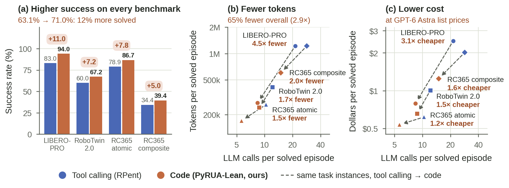

<div align="center">

# PyRUA-Lean

**让机器人 agent 写代码行动，而不是一次次调用工具。**

[](LICENSE)
[](pyproject.toml)
[](README.md)
[](README.zh-CN.md)

</div>

**PyRUA-Lean**（*Py*thon for lean *R*obot-*U*se *A*gents，对应电脑操作领域的 computer-use agent）把机器人变成一个
Python 对象。工具调用式的 agent 在任务的每一个小步上都要花一次完整的 LLM 调用，而且每次都要把之前的全部内容重发一遍；
PyRUA-Lean 的 agent 则对着 `robo` 写代码，一次调用就能完成找到物体、移到上方、抓取、检查夹爪、失败重试这一整串动作。

<p align="center">
  
</p>

## 为什么用代码

同一个模型（GPT-6 Astra）、同一套机器人原语、VLA 策略和仿真器、同样的 LLM 调用预算，只改变动作的形式。
成功率是从 tool calling 到 PyRUA-Lean；token 和花费按两边都解出的任务实例计算：

| 基准 | 成功率 | token | 按官方价格的花费 |
|---|---|---|---|
| LIBERO-PRO（40 个任务） | 83.0% → **94.0%** | 少 **4.5×** | 便宜 **3.1×** |
| RoboTwin 2.0（50 个任务） | 60.0% → **67.2%** | 少 **1.7×** | 便宜 **1.5×** |
| RoboCasa365 atomic（18 个任务） | 78.9% → **86.7%** | 少 **1.5×** | 便宜 **1.2×** |
| RoboCasa365 composite（32 个任务） | 34.4% → **39.4%** | 少 **2.0×** | 便宜 **1.6×** |

四个基准合起来，PyRUA-Lean 多解出 12% 的任务实例，在两边都解出的任务上少用 65% 的 token。

## agent 写的是什么

agent 只有一个工具 `python(code)`，在一个装着 `robo` 的持久命名空间里执行。一次 LLM 调用就能做完下面这些：

```python
bowl = robo.segment("the black bowl on the stove")                # SAM3 + 深度：得到世界坐标中的一个点
x, y, _ = bowl.world_xyz
robo.move_to([x, y + 0.045, 0.60])                                # 脚本化伺服；返回实际发生了什么
pick = robo.pi0_pick("pick up the black bowl", max_chunks=8)      # 冻结的 Pi0.5 VLA 技能
if robo.state().gripper_opening < 0.01:                           # 夹空了：再试一次
    pick = robo.pi0_pick("pick up the black bowl", max_chunks=8)
print(pick.success, pick.peak_lift_m)                             # agent 只读它打印出来的内容
robo.show("wrist")                                                # 也只在需要时才看图像
```

工具调用式的 agent 会在其中每一步上各花一次 LLM 调用，而每次调用都要把之前的对话连同相机图像重发一遍。

## 快速上手

PyRUA-Lean 驱动的是 [RPent](https://github.com/RLinf/RPent) 的机器人环境：先按你要用的机器人装好 RPent
（版本、模型权重和环境变量见 [docs/setup.md](docs/setup.md)）。agent 通过
[Codex CLI](https://github.com/openai/codex) 0.155.1 或 Claude Code 运行。

```bash
git clone https://github.com/DAGroup-PKU/PyRUA-Lean.git && cd PyRUA-Lean
pip install -e .          # 装进你的 RPent 机器人环境所用的 Python
pyrualean api             # 打印 agent 看到的机器人接口；不需要仿真器

# 跑一局 LIBERO-PRO：GPT-6 Astra 对着 robo 写代码，最多 40 次 LLM 调用
export RPENT_ROOT=/path/to/rpent
pyrualean play --arm cells --suite libero_spatial_swap --task 7 --seed 2 \
    --model gpt-6-astra --max-turns 40 --out runs/demo --cuda-device 0
pyrualean summarize runs/demo
```

运行目录里保存了这一局的视频、agent 运行过的每个代码单元及其输出、原语调用记录、token 用量，以及基准自己的成功判定。

## 支持的机器人

| `--robot` | 基准 | 机器人与技能 |
|---|---|---|
| `libero`（默认） | LIBERO-PRO | Franka 单臂；脚本化伺服、Pi0.5 VLA、SAM3 感知 |
| `robotwin` | RoboTwin 2.0 | 双臂；LingBot-VLA |
| `robocasa` | RoboCasa365 | 移动操作机器人；RLDX-1 VLA、导航 |

新增机器人的约定见 [docs/multi-robot.md](docs/multi-robot.md)。

## 工作方式

- **同样的原语，同样的判分。** `robo` 的每个方法一一对应 RPent 的一个工具，并经由 RPent 执行，所以一局留下的记录和
  RPent 的一局相同，成功与否由基准自己的判定决定。
- **返回结果，而不是抛异常。** 运动调用会阻塞，并返回实际发生了什么（`Move.reached`、`Pick.success` 等）；
  误用会报错，任务完成后所有后续运动都会被拦下。
- **不会过时的 prompt。** agent 读到的接口说明直接从运行中的类生成。
- **三种运行方式。** `play --arm cells`（每次决策一个代码单元）、`play --arm program`（整段程序），以及
  `generate` + `run` 的单次生成。
- **沙箱执行。** agent 的代码只能导入固定的一组模块，文件访问限制在它的工作目录内，拿不到后端的句柄。

## 文档

- [docs/guide.zh-CN.md](docs/guide.zh-CN.md)：`robo` 接口、prompt、单次与交互式运行、预算、评测与配置。
- [docs/setup.md](docs/setup.md)：搭建三个机器人环境和 agent 运行时（英文）。

## 许可与致谢

Apache License 2.0（[LICENSE](LICENSE)）。PyRUA-Lean 构建在 [RPent](https://github.com/RLinf/RPent)（Apache-2.0）
之上：`robo` 背后的机器人环境、服务和原语实现都来自 RPent，工具调用的基线就是 RPent 本身，本仓库的部分代码也改编自它，
详见 `NOTICE`。如果你用到了 RPent，请引用它的论文
[Harness VLA: Steering Frozen VLAs into Reliable Manipulation Primitives via Memory-Guided Agents](https://arxiv.org/abs/2607.08448)。
